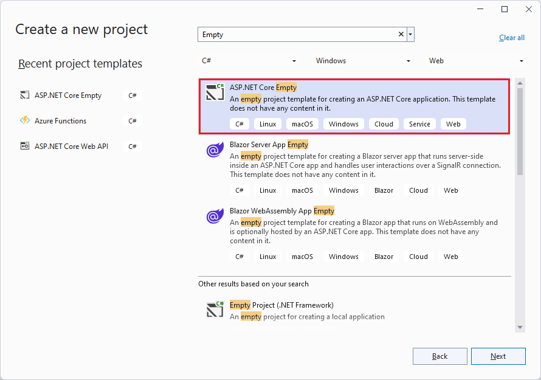
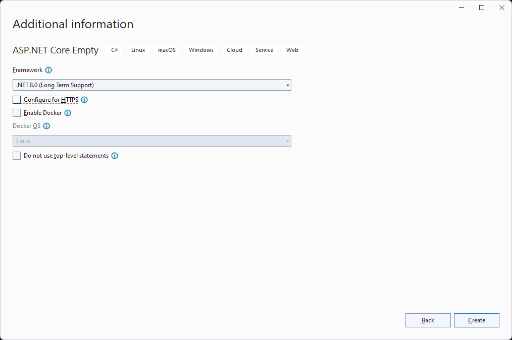

# Build a RESTful Service with ASP.NET Core OData

In this exercise, we will go through how to build a RESTful service using ASP.NET Core OData and Entity Framework Core.

The service will manager customers and orders saved in an in-memory database.

## Function requirements

| Description | Method | URI |
| ------ | --- | ----------- |
| Return all customers | GET | /Customers |
| Return customer by key |GET | /Customers({key}) | 
| Add a customer | POST | /Customers |
| Patch an existing customer | PATCH | /Customers({key}) |
| Update an existing customer | PUT | /Customers({key}) |
| Delete a customer | DELETE | /Customers({key}) |
| Return all Orders | GET | /Orders |
| Return order by key | GET | /Orders({key}) |
| Add an order | POST | /Orders |
| Patch an existing order | PATCH | /Orders({key}) |
| Update an existing order | PUT | /Orders({key}) |
| Link an order to a customer | PUT | /Orders({key})/Customer({relatedKey}) |
| Delete an order | DELETE | /Orders({key}) |
| Transformations - filtering, sorting, etc | GET | - |

## Create an ASP.NET Core application

- Start Visual Studio 2022 and select **Create a new project**.
- In the **Create a new project** dialog:
  - Enter `Empty` in the **Search for templates** search box.
  - Select **ASP.NET Core Empty** project template and select **Next**.

    

- Name the project _**FS20240422**_ and select **Next**.
- In the **Additional information** dialog: 
  - Select **.NET 8.0 (Long Term Support)**.
  - Uncheck **Configure for HTTPS** checkbox.
  - Select **Create**.

  

## Add data models
In **Solution Explorer**, right-click the project. Select **Add->New Folder** and name the folder **Models**.

Then right-click the **Models** folder and select **Add->Class**. Name the class _**Customer.cs**_.

Right-click the **Models** folder again and select **Add->Class**. Name the class _**Order.cs**_.

Next, replace the contents of _**Customer.cs**_ and _**Order.cs**_ with the following class definitions respectively:

**`Customer` class**
```csharp
namespace FS20240422.Models
{
    public class Customer
    {
        public int Id { get; set; }
        public string Name { get; set; }
        public string City { get; set; }
        public List<Order>? Orders { get; set; }
    }
}
```

**`Order` class**
```csharp
namespace FS20240422.Models
{
    public class Order
    {
        public int Id { get; set; }
        public DateTimeOffset OrderDate { get; set; }
        public decimal Amount { get; set; }
        public Customer? Customer { get; set; }
    }
}
```

## Entity Framework Core (EF Core)
EF Core is an object-relational mapping (ORM) framework for the .NET platform. It enables interaction with the database using .NET objects.

In this exercise, we will employ the _**Code First**_ approach by first defining our data models and configuring the mapping between them and leverage EF Core to create the database schema based on the models.

Just to keep things simple, we will use the **Microsoft.EntityFrameworkCore.InMemory** database provider package that allows EF Core to be used with an in-memory database.
This choice of database provider package is not advisable for real-world applications since all data is lost once the service is stopped.

Let's add the EF Core NuGet packages to the project.

### Add `Microsoft.EntityFrameworkCore.InMemory` using Visual Studio

In the Visual Studio **Package Manager Console**:

```
Install-Package Microsoft.EntityFrameworkCore.InMemory
```

### Add `Microsoft.EntityFrameworkCore.InMemory` using .NET Core CLI

```
dotnet add package Microsoft.EntityFrameworkCore.InMemory
```

## Adding a database context
A _database context_ class is an integral component of EF Core. An instance of the _database context_ represents a session with the database that can be used to query and save instances of your entities.

The _database context_ class needs to derive from the [`Microsoft.EntityFrameworkCore.DbContext`](https://docs.microsoft.com/dotnet/api/microsoft.entityframeworkcore.dbcontext) class.

In **Solution Explorer**, right-click the project. Select **Add->New Folder** and name the folder **Data**.

Then right-click the **Data** folder and select **Add->Class**. Name the class _**FsDbContext.cs**_.

Next, replace the contents of _**FsDbContext.cs**_ with the following:

```csharp
using FS20240422.Models;
using Microsoft.EntityFrameworkCore;

namespace FS20240422.Data
{
    public class FsDbContext : DbContext
    {
        public FsDbContext(DbContextOptions<FsDbContext> options)
            : base(options)
        {
        }

        public DbSet<Customer> Customers { get; set; }
        public DbSet<Order> Orders { get; set; }
    }
}
```

In the code block above, we are adding a `Customers` property of type `DbSet<Customer>` and an `Orders` property of type `DbSet<Order>`. EF Core will map the two properties will be mapped to the `Customers` and `Orders` tables respectively.

## Registering the database context as a service
ASP.NET Core supports the [dependency injection (DI)](https://learn.microsoft.com/aspnet/core/fundamentals/dependency-injection) software design pattern. Objects of dependency classes are injected through the contructor using the built-in Inversion of Control (IoC) container.

Let's register `FsDbContext` class with IoC container such that it will be automatically injected in the constructors of classes that depends on it - constructor injection.

Replace the contents of _**Program.cs**_ with the following:

```csharp
using FS20240422.Data;
using Microsoft.EntityFrameworkCore;

var builder = WebApplication.CreateBuilder(args);

// Configure the DbContext
builder.Services.AddDbContext<FsDbContext>(
    options => options.UseInMemoryDatabase("FsDb"));

var app = builder.Build();

app.UseRouting();
```

## Seed database with data
Let's seed the database with some initial data. We will create a helper class for that purpose.

In **Solution Explorer**, right-click the **Data** folder and select **Add->Class**. Name the class _**FsDbHelper.cs**_.

Next, replace the contents of _****FsDbHelper.cs**_ with the following:
```csharp
using FS20240422.Models;

namespace FS20240422.Data
{
    internal static class FsDbHelper
    {
        private static List<Customer> customers;
        private static List<Order> orders;

        static FsDbHelper()
        {
            customers = new List<Customer>
            {
                new Customer
                {
                    Id = 1,
                    Name = "Sue",
                    City = "NBI"
                },
                new Customer
                {
                    Id = 2,
                    Name = "Joe",
                    City = "MSA"
                },
                new Customer
                {
                    Id = 3,
                    Name = "Luc",
                    City = "NBI"
                }
            };

            orders = new List<Order>
            {
                new Order
                {
                    Id = 1,
                    OrderDate = new DateTimeOffset(new DateTime(2024, 4, 7)),
                    Amount = 190,
                    Customer = customers[1]
                },
                new Order
                {
                    Id = 2,
                    OrderDate = new DateTimeOffset(new DateTime(2024, 4, 3)),
                    Amount = 130,
                    Customer = customers[0]
                },
                new Order
                {
                    Id = 3,
                    OrderDate = new DateTimeOffset(new DateTime(2024, 4, 13)),
                    Amount = 50,
                    Customer = customers[0]
                },
                new Order
                {
                    Id = 4,
                    OrderDate = new DateTimeOffset(new DateTime(2024, 4, 17)),
                    Amount = 110,
                    Customer = customers[1]
                },
                new Order
                {
                    Id = 5,
                    OrderDate = new DateTimeOffset(new DateTime(2024, 4, 5)),
                    Amount = 70,
                    Customer = customers[0]
                }
            };
        }

        public static void SeedDb(FsDbContext db)
        {
            if (!db.Customers.Any())
            {
                db.Customers.AddRange(customers);
            }

            if (!db.Orders.Any())
            {
                db.Orders.AddRange(orders);
            }

            db.SaveChanges();
        }
    }
}
```

In the code block above, we initialize one collection with 3 `Customer` instances and another with 5 `Order` instances from the constructor of the `FsDbHelper` static class.
We expose a public `SeedDb` method that may be invoked to add the two collections to the respective entity sets in the database.

To invoke the `FsDbHelper.SeedDb` method when the service is starting, add the following code to _**Program.cs** - right above `app.Run()`:

```csharp
// Add seed data to the database
using (var serviceScope = app.Services.GetRequiredService<IServiceScopeFactory>().CreateScope())
{
    var db = serviceScope.ServiceProvider.GetRequiredService<FsDbContext>();

    FsDbHelper.SeedDb(db);
}
```

In the code block above, we create an `IServiceScope` which contains an `IServiceProvider` - the ASP.NET Core built-in IoC container - and use that to resolve `FsDbContext` as a scoped service, and pass the instance to the `FsDbHelper.SeedDb` method.

## Adding `Microsoft.AspNetCore.OData` package

**`Microsoft.AspNetCore.OData`** is an ASP.NET Core extension package that facilitates building of OData RESTful APIs using the ASP.NET Core framework.
It simplifies creation of OData-compliant APIs within the ASP.NET Core applications.
For instance, it extends the ASP.NET Core’s routing capabilities to support OData-specific conventions for defining routes and handling OData requests.

Let's add the EF Core NuGet packages to the project.

### Add `Microsoft.EntityFrameworkCore.InMemory` using Visual Studio

In the Visual Studio **Package Manager Console**:

```
Install-Package Microsoft.AspNetCore.OData
```

### Add `Microsoft.EntityFrameworkCore.InMemory` using .NET Core CLI

```
dotnet add package Microsoft.AspNetCore.OData
```

## Building the Edm model and adding essential OData services
OData services use an abstract data model called the Entity Data Model (EDM) to describe the data exposed by the service. The `Microsoft.AspNetCore.OData` library is dependent on the `Microsoft.OData.Edm` library that can be used to generate an Edm model from CLR (Common Language Runtime) types representing the domain model.

In this exercise, we are going to use the `ODataConventionalModelBuilder` to build the Edm model.

Let's build the Edm model and register the essential OData services.

Add the following code to _**Program.cs** - right below `var builder = WebApplication.CreateBuilder(args);` statement:

```csharp
// Build the Edm model
var modelBuilder = new ODataConventionModelBuilder();
modelBuilder.EntitySet<Customer>("Customers");
modelBuilder.EntitySet<Order>("Orders");

// Configure the OData service
builder.Services.AddControllers().AddOData(
    options =>
    {
        options.EnableQueryFeatures();
        options.AddRouteComponents(
            model: modelBuilder.GetEdmModel());
    });
```

In the above code block, we are using the `ODataConventionalModelBuilder` to build the Edm model. As part of the model, we register `Customers` and `Orders` as entity sets.
We are also adding essential OData services by calling the `AddOData` method. In the process enabling different OData query features in addition to calling `AddRouteComponents` method to register a route - default empty route in this case while passing along the Edm model to associate it with.

## Adding OData controllers
Each incoming HTTP request is matched to a route and dispatched to the corresponding executable endpoints in the OData service. In our case, we are going to implement the executable endpoints using OData controllers.

Let's implement the OData controllers to handle incoming requests.

In **Solution Explorer**, right-click the project. Select **Add->New Folder** and name the folder **Controllers**.

Then right-click the **Controllers** folder and select **Add->Class**. Name the class _**CustomersController.cs**_.

Right-click the **Controllers** folder again and select **Add->Class**. Name the class _**OrdersController.cs**_.

Next, replace the contents of _**CustomersController.cs**_ and _**OrdersController.cs**_ with the following class definitions respectively:

**`CustomersController` class**
```csharp
using FS20240422.Data;
using FS20240422.Models;
using Microsoft.AspNetCore.Mvc;
using Microsoft.AspNetCore.OData.Deltas;
using Microsoft.AspNetCore.OData.Query;
using Microsoft.AspNetCore.OData.Results;
using Microsoft.AspNetCore.OData.Routing.Controllers;

namespace FS20240422.Controllers
{
    public class CustomersController : ODataController
    {
        private readonly FsDbContext db;

        public CustomersController(FsDbContext db)
        {
            this.db = db;
        }
    }
}
```

**`OrdersController` class**
```csharp
using FS20240422.Data;
using FS20240422.Models;
using Microsoft.AspNetCore.Mvc;
using Microsoft.AspNetCore.OData.Deltas;
using Microsoft.AspNetCore.OData.Query;
using Microsoft.AspNetCore.OData.Results;
using Microsoft.AspNetCore.OData.Routing.Controllers;

namespace FS20240422.Controllers
{
    public class OrdersController : ODataController
    {
        private readonly FsDbContext db;

        public OrdersController(FsDbContext db)
        {
            this.db = db;
        }
    }
}
```

In the above 2 code blocks, we are defined two controllers that inherit from `ODataController`. The `ODataController` class implements shared logic required when writing and reading data using the OData formats.

Take note of how both controllers have an `FsDbContext` dependency that is initialized through the constructor. Since we registered `FsDbContext` as a service in the DI container, the dependency will be resolved by ASP.NET Core automatically and injected into the constructor as the controller is being constructed.

## Implementing API endpoints
For each API we want to expose, we need to implement the logic that should be executed. In ASP.NET Core OData, an endpoint represents a controller action that the incoming request resolves to, along with other metadata attached to the route that matches the request.

If you take a look at _**Program.cs**_ file, you'll notice the `app.UseRouting();` statement. This statement adds route matching to the middleware pipeline. It is responsible for matching the URLs of incoming requests and mapping them to controller actions. The matching process can extract values from the request's URL and provide those values for request processing.

To add endpoint execution responsible for running the delegate associated with the matched endpoint to the middleware pipeline, let's beginning by adding the following code to _**Program.cs**_ - right below `app.UseRouting();` statement:

```csharp
app.MapControllers();
```

Controller actions are either conventionally-routed or attribute-routed. Placing a route on the controller or action makes it attribute-routed. Conventional routing involves naming controller actions following a particular naming convention. For example, the request for an entity by key is routed to a controller action named `Get` that accepts a paramater named `key`.

### Returning all customers
Let's implement the controller action for handling the request to return all customers.

Add the following code to **`CustomersController`** class:

```csharp
        [EnableQuery]
        public ActionResult<IQueryable<Customer>> Get()
        {
            return this.db.Customers;
        }
```

In the above block of code, the `Get` method returns all the customers in our database as `IQueryable<Customer>`.

This controller action is executed when the incoming request is an HTTP GET matching the `/Customers` route template.

We can test this by calling the endpoint from a browser or and API client app like [Postman](https://www.postman.com/).

Press F5 to build and run the service. Take note of the endpoint that the application is listening on - http://localhost:5074. **The port might be different in your environment**.

#### Testing the Get controller action - /Customers
```http
GET http://localhost:5074/Customers
```

**Response:**
```json
{
    "@odata.context": "http://localhost:5074/$metadata#Customers",
    "value": [
        {
            "Id": 1,
            "Name": "Sue",
            "City": "NBI"
        },
        {
            "Id": 2,
            "Name": "Joe",
            "City": "MSA"
        },
        {
            "Id": 3,
            "Name": "Luc",
            "City": "NBI"
        }
    ]
}
```

The above JSON is in OData response format. The collection of values assigned to the `value` property comprises the customers in our database. If you recall, the `Customer` class had an `Orders` collection property. That property is not included in the above response. We'll revisit that later in the exercise.

If you don't have an API client, you can use the `curl` command from the Windows command prompt to execute the above command:
```
curl -i -X GET http://localhost:5074/Customers
```

### Returning a customer by key
Let's implement the controller action for handling the request to return a single customer by key.

Add the following code to **`CustomersController`** class:

```csharp
        [EnableQuery]
        public SingleResult<Customer> Get(int key)
        {
            return SingleResult.Create(this.db.Customers.Where(d => d.Id == key));
        }
```

In the above block of code, the `Get` method accepts an `int` parameter named `key` and returns a customer matching that key in our database. If a customer matching that key is not found, we return a `404 Not Found` response.

This controller action is executed when the incoming request is an HTTP GET matching the `/Customers({key})` or `/Customers/{key}` route template.

#### Testing the Get controller action - /Customers({key})
```http
GET http://localhost:5074/Customers(1)
```

**Response:**
```json
{
    "@odata.context": "http://localhost:5074/$metadata#Customers/$entity",
    "Id": 1,
    "Name": "Sue",
    "City": "NBI"
}
```

To accomplish the same using the `curl` command:
```
curl -i -X GET http://localhost:5074/Customers(1)
```

### Adding a customer
Let's implement the controller action for handling the request to add a customer.

Add the following code to **`CustomersController`** class:

```csharp
        public ActionResult Post([FromBody] Customer customer)
        {
            if (customer == null || customer.Id == 0)
            {
                return BadRequest();
            }

            var dbCustomer = this.db.Customers.FirstOrDefault(d => d.Id == customer.Id);

            if (dbCustomer != null)
            {
                return Conflict();
            }

            db.Customers.Add(customer);
            db.SaveChanges();

            return Created(customer);
        }
```

In the above block of code, the `Post` method accepts a `Customer` parameter decorated with `FromBody` attribute. This attribute is used to indicate that the payload is expected in the request body.

We handle the scenario where the `customer` parameter is `null` or the `Id` not being assigned and return a `400 Bad Request` response. We also handle the scenario where the specified `Id` already exists in our database and return a `409 Conflict` response. If everything checks out, we add the customer to the database, save changes and return a `201 Created` response.

This controller action is executed when the incoming request is an HTTP POST matching the `/Customers` route template.

#### Testing the Post controller action - /Customers
```http
POST http://localhost:5074/Customers
```

Headers: `Content-Type:application/json`

**Request body**:
```json
{
    "Id":4,
    "Name":"Bob",
    "City":"KSM"
}
```

**Response:**
```json
{
    "@odata.context": "http://localhost:5074/$metadata#Customers/$entity",
    "Id": 4,
    "Name": "Bob",
    "City": "KSM"
}
```

To accomplish the same using the `curl` command:
```
curl -i -X POST -H "Content-Type:application/json" -d "{\"Id\":4,\"Name\":\"Bob\",\"City\":\"KSM\"}" http://localhost:5074/Customers
```

### Patch an existing customer
Let's implement the controller action for handling the request to patch an existing customer.

Add the following code to **`CustomersController`** class:

```csharp
        public ActionResult Patch(int key, [FromBody] Delta<Customer> delta)
        {
            if (delta == null)
            {
                return BadRequest();
            }

            var customer = this.db.Customers.FirstOrDefault(d => d.Id == key);

            if (customer == null)
            {
                return BadRequest();
            }

            delta.Patch(customer);

            db.SaveChanges();

            return Ok();
        }
```

In the above block of code, the `Patch` method accepts an `int` parameter named `key` and a `Delta<Customer>` parameter decorated with `FromBody` attribute.

We handle the scenario where the `delta` parameter is `null` and the scenario where we can't match the customer by key and return a `400 Bad Request` response. If everything checks out, we call the `delta.Patch` method to patch the customer entity retrieved from the database, save changes and return a `200 OK` response.

This controller action is executed when the incoming request is an HTTP PATCH matching the `/Customers({key})` route template.

#### Testing the Patch controller action - /Customers({key})
```http
PATCH http://localhost:5074/Customers(3)
```

Headers: `Content-Type:application/json`

**Request body**:
```json
{
    "Name":"Jim"
}
```

The above patch payload contains only the `Name` property.

To accomplish the same using the `curl` command:
```
curl -i -X PATCH -H "Content-Type:application/json" -d "{\"Name\":\"Jim\"}" http://localhost:5074/Customers(3)
```

### Updating an existing customer
The difference between PATCH and PUT is that former is a modification operation while the latter is a replacement operation.

Let's implement the controller action for handling the request to update an existing customer.

Add the following code to **`CustomersController`** class:

```csharp
        public ActionResult Put(int key, [FromBody] Customer customer)
        {
            if (customer == null)
            {
                return BadRequest();
            }

            var dbOrder = this.db.Customers.FirstOrDefault(d => d.Id == key);

            if (dbOrder == null)
            {
                return BadRequest();
            }

            dbOrder.Name = customer.Name;
            dbOrder.City = customer.City;

            db.SaveChanges();

            return Ok();
        }
```

In the above block of code, the `Put` method accepts an `int` parameter named `key` and a `Customer` parameter decorated with `FromBody` attribute.

We handle the scenario where the `customer` parameter is `null` and the scenario where we can't match the customer by key and return a `400 Bad Request` response. If everything checks out, we call set properties of the customer entity retrieved from the database with the values in the `customer` parameter, save changes and return a `200 OK` response.

#### Testing the Put controller action - /Customers({key})
This controller action is executed when the incoming request is an HTTP PUT matching the `/Customers({key})` route template.

```http
PUT http://localhost:5074/Customers(3)
```

Headers: `Content-Type:application/json`

**Request body**:
```json
{
    "Id":3,
    "Name":"Tom",
    "City":"ELD"
}
```

To accomplish the same using the `curl` command:
```
curl -i -X PUT -H "Content-Type:application/json" -d "{\"Id\":3,\"Name\":\"Tom\",\"City\":\"ELD\"}" http://localhost:5074/Customers(3)
```

### Deleting a customer
Let's implement the controller action for handling the request to delete a customer.

Add the following code to **`CustomersController`** class:

```csharp
        public ActionResult Delete(int key)
        {
            var customer = this.db.Customers.FirstOrDefault(d => d.Id == key);

            if (customer != null)
            {
                db.Customers.Remove(customer);
                db.SaveChanges();
            }

            return Ok();
        }
```

In the above block of code, the `Delete` method accepts an `int` parameter named `key`. If a customer matching that key is found, we delete the customer and return a `200 OK` response.

This controller action is executed when the incoming request is an HTTP DELETE matching the `/Customers({key})` or `/Customers/{key}` route template.

#### Testing the Delete controller action - /Customers({key})
```http
DELETE http://localhost:5074/Customers(3)
```

To accomplish the same using the `curl` command:
```
curl -i -X DELETE http://localhost:5074/Customers(3)
```

### Returning all orders
Let's implement the controller action for handling the request to return all orders.

Add the following code to **`OrdersController`** class:

```csharp
        [EnableQuery]
        public ActionResult<IQueryable<Order>> Get()
        {
            return this.db.Orders;
        }
```

In the above block of code, the `Get` method returns all the orders in our database as `IQueryable<Order>`.

This controller action is executed when the incoming request is an HTTP GET matching the `/Orders` route template.

We can test this by calling the endpoint from a browser or and API client app like [Postman](https://www.postman.com/).

Press F5 to build and run the service. Take note of the endpoint that the application is listening on - http://localhost:5074. **The port might be different in your environment**.

#### Testing the Get controller action - /Orders
```http
GET http://localhost:5074/Orders
```

**Response:**
```json
{
    "@odata.context": "http://localhost:5074/$metadata#Orders",
    "value": [
        {
            "Id": 1,
            "OrderDate": "2024-04-07T00:00:00+03:00",
            "Amount": 190
        },
        {
            "Id": 2,
            "OrderDate": "2024-04-03T00:00:00+03:00",
            "Amount": 130
        },
        {
            "Id": 3,
            "OrderDate": "2024-04-13T00:00:00+03:00",
            "Amount": 50
        },
        {
            "Id": 4,
            "OrderDate": "2024-04-17T00:00:00+03:00",
            "Amount": 110
        },
        {
            "Id": 5,
            "OrderDate": "2024-04-19T00:00:00+03:00",
            "Amount": 30
        },
        {
            "Id": 6,
            "OrderDate": "2024-04-02T00:00:00+03:00",
            "Amount": 230
        }
    ]
}
```

The above JSON is in OData response format. The collection of values assigned to the `value` property comprises the orders in our database. If you recall, the `Order` class had an `Orders` collection property. That property is not included in the above response. We'll revisit that later in the exercise.

If you don't have an API client, you can use the `curl` command from the Windows command prompt to execute the above command:
```
curl -i -X GET http://localhost:5074/Orders
```

### Returning an order by key
Let's implement the controller action for handling the request to return a single order by key.

Add the following code to **`OrdersController`** class:

```csharp
        [EnableQuery]
        public SingleResult<Order> Get(int key)
        {
            return SingleResult.Create(this.db.Orders.Where(d => d.Id == key));
        }
```

In the above block of code, the `Get` method accepts an `int` parameter named `key` and returns an order matching that key in our database. If an order matching that key is not found, we return a `404 Not Found` response.

This controller action is executed when the incoming request is an HTTP GET matching the `/Orders({key})` or `/Orders/{key}` route template.

#### Testing the Get controller action - /Orders({key})
```http
GET http://localhost:5074/Orders(1)
```

**Response:**
```json
{
    "@odata.context": "http://localhost:5074/$metadata#Orders/$entity",
    "Id": 1,
    "OrderDate": "2024-04-07T00:00:00+03:00",
    "Amount": 190
}
```

To accomplish the same using the `curl` command:
```
curl -i -X GET http://localhost:5074/Orders(1)
```

### Adding an order
Let's implement the controller action for handling the request to add an order.

Add the following code to **`OrdersController`** class:

```csharp
        public ActionResult Post([FromBody] Order order)
        {
            if (order.Id == 0)
            {
                return BadRequest();
            }

            var dbOrder = this.db.Orders.FirstOrDefault(d => d.Id == order.Id);

            if (dbOrder != null)
            {
                return Conflict();
            }

            db.Orders.Add(order);
            db.SaveChanges();

            return Created(order);
        }
```

In the above block of code, the `Post` method accepts a `Order` parameter decorated with `FromBody` attribute. This attribute is used to indicate that the payload is expected in the request body.

We handle the scenario where the `order` parameter is `null` or the `Id` not being assigned and return a `400 Bad Request` response. We also handle the scenario where the specified `Id` already exists in our database and return a `409 Conflict` response. If everything checks out, we add the order to the database, save changes and return a `201 Created` response.

This controller action is executed when the incoming request is an HTTP POST matching the `/Orders` route template.

#### Testing the Post controller action - /Orders
```http
POST http://localhost:5074/Orders
```

Headers: `Content-Type:application/json`

**Request body**:
```json
{
    "Id":6,
    "OrderDate":"2024-04-02",
    "Amount":230
}
```

**Response:**
```json
{
    "@odata.context": "http://localhost:5074/$metadata#Orders/$entity",
    "Id": 6,
    "OrderDate": "2024-04-02T00:00:00+03:00",
    "Amount": 230
}
```

To accomplish the same using the `curl` command:
```
curl -i -X POST -H "Content-Type:application/json" -d "{\"Id\":6,\"OrderDate\":\"2024-04-02\",\"Amount\":230}" http://localhost:5074/Orders
```

### Patch an existing order
Let's implement the controller action for handling the request to patch an existing order.

Add the following code to **`OrdersController`** class:

```csharp
        public ActionResult Patch(int key, [FromBody] Delta<Order> delta)
        {
            if (delta == null)
            {
                return BadRequest();
            }

            var order = this.db.Orders.FirstOrDefault(d => d.Id == key);

            if (order == null)
            {
                return BadRequest();
            }

            delta.Patch(order);

            db.SaveChanges();

            return Ok();
        }
```

In the above block of code, the `Patch` method accepts an `int` parameter named `key` and a `Delta<Order>` parameter decorated with `FromBody` attribute.

We handle the scenario where the `delta` parameter is `null` and the scenario where we can't match the order by key and return a `400 Bad Request` response. If everything checks out, we call the `delta.Patch` method to patch the order entity retrieved from the database, save changes and return a `200 OK` response.

This controller action is executed when the incoming request is an HTTP PATCH matching the `/Orders({key})` route template.

#### Testing the Patch controller action - /Orders({key})
```http
PATCH http://localhost:5074/Orders(3)
```

Headers: `Content-Type:application/json`

**Request body**:
```json
{
    "Amount":30
}
```

The above patch payload contains only the `Name` property.

To accomplish the same using the `curl` command:
```
curl -i -X PATCH -H "Content-Type:application/json" -d "{\"Amount\":30}" http://localhost:5074/Orders(5)
```

### Updating an existing order
The difference between PATCH and PUT is that former is a modification operation while the latter is a replacement operation.

Let's implement the controller action for handling the request to update an existing order.

Add the following code to **`OrdersController`** class:

```csharp
        public ActionResult Put(int key, [FromBody] Order order)
        {
            if (order == null)
            {
                return BadRequest();
            }   
            
            var dbOrder = this.db.Orders.FirstOrDefault(d => d.Id == key);

            if (dbOrder == null)
            {
                return BadRequest();
            }

            dbOrder.OrderDate = order.OrderDate;
            dbOrder.Amount = order.Amount;

            db.SaveChanges();

            return Ok();
        }
```

In the above block of code, the `Put` method accepts an `int` parameter named `key` and a `Order` parameter decorated with `FromBody` attribute.

We handle the scenario where the `order` parameter is `null` and the scenario where we can't match the order by key and return a `400 Bad Request` response. If everything checks out, we call set properties of the order entity retrieved from the database with the values in the `order` parameter, save changes and return a `200 OK` response.

#### Testing the Put controller action - /Orders({key})
This controller action is executed when the incoming request is an HTTP PUT matching the `/Orders({key})` route template.

```http
PUT http://localhost:5074/Orders(5)
```

Headers: `Content-Type:application/json`

**Request body**:
```json
{
    "Id":5,
    "OrderDate":"2024-04-19",
    "Amount":190
}
```

To accomplish the same using the `curl` command:
```
curl -i -X PUT -H "Content-Type:application/json" -d "{\"Id\":5,\"OrderDate\":\"2024-04-19\",\"Amount\":190}" http://localhost:5074/Orders(5)
```

### Deleting an order
Let's implement the controller action for handling the request to delete an order.

Add the following code to **`OrdersController`** class:

```csharp
        public ActionResult Delete(int key)
        {
            var order = this.db.Orders.FirstOrDefault(d => d.Id == key);

            if (order != null)
            {
                db.Orders.Remove(order);
                db.SaveChanges();
            }

            return Ok();
        }
```

In the above block of code, the `Delete` method accepts an `int` parameter named `key`. If an order matching that key is found, we delete the order and return a `200 OK` response.

This controller action is executed when the incoming request is an HTTP DELETE matching the `/Orders({key})` or `/Orders/{key}` route template.

#### Testing the Delete controller action - /Orders({key})
```http
DELETE http://localhost:5074/Orders(5)
```

To accomplish the same using the `curl` command:
```
curl -i -X DELETE http://localhost:5074/Orders(5)
```

### Linking an order to a customer
Let's implement the controller action for handling the request to link an order to a customer.

Add the following code to **`OrdersController`** class:

```csharp
        public ActionResult CreateRefToCustomer(int key, int relatedKey)
        {
            var order = this.db.Orders.FirstOrDefault(d => d.Id == key);

            if (order == null)
            {
                return BadRequest();
            }

            var customer = this.db.Customers.FirstOrDefault(d => d.Id == relatedKey);

            if (customer == null)
            {
                return BadRequest();
            }

            order.Customer = customer;

            db.SaveChanges();

            return Ok();
        }
```

In the above block of code, the `CreateRefToCustomer` method accepts an `int` parameter named `key` and a second `int` parameter named `relatedKey`. We handle the the scenario where we can't match the order by key and customer by related key and return a `400 Bad Request` response. If everything checks out, we assign the customer entity to the order's `Customer` property and return a `200 OK` response.

This controller action is executed when the incoming request is an HTTP DELETE matching the `/Orders({key})/Customer({relatedKey})/$ref` or `/Orders/{key}/Customer/{relatedKey}/$ref` route template.

#### Testing the CreateRefToCustomer controller action - /Orders({key})/Customer({relatedKey})/$ref
```http
PUT http://localhost:5074/Orders(6)/Customer(2)/$ref
```

To accomplish the same using the `curl` command:
```
curl -i -X PUT http://localhost:5074/Orders(6)/Customer(2)/$ref
```

### Transformations - filtering, sorting, etc
If you recall, we made a call to `EnableQueryFeatures` method from _**Program.cs**_. In addition, where decorated the `Get` controller action methods with `EnableQuery` method. ASP.NET Core OData libraries uses those two to provide out-of-the-box querying capabilities.

You can do all manner of transformations without having to write extra logic. In addition, related entities are not returned in an OData response by default. To return related entities, you can use the `$expand` query option.

#### Testing transformations
```
GET http://localhost:5074/Orders?$filter=Amount gt 100
GET http://localhost:5074/Orders(1)?$expand=Customer
GET http://localhost:5074/Orders?$orderby=Amount desc
GET http://localhost:5074/Customers?$expand=Id,Name
GET http://localhost:5074/Orders?$orderby=Amount desc&$top=2
GET http://localhost:5074/Orders?$orderby=Amount desc&$skip=2&$top=2
GET http://localhost:5074/Orders?$apply=aggregate(Amount with average as AverageAmount)
```